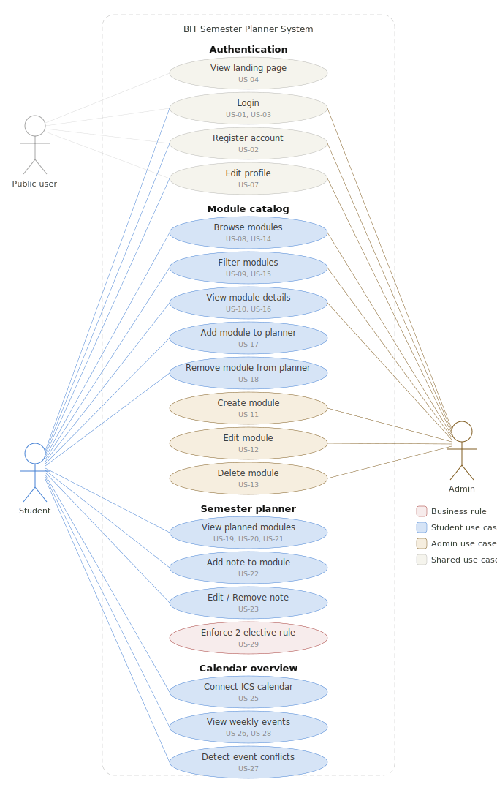
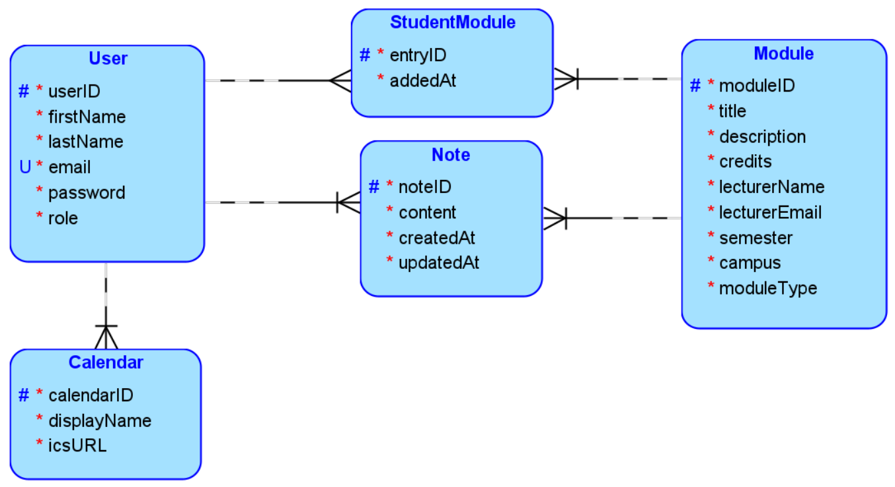
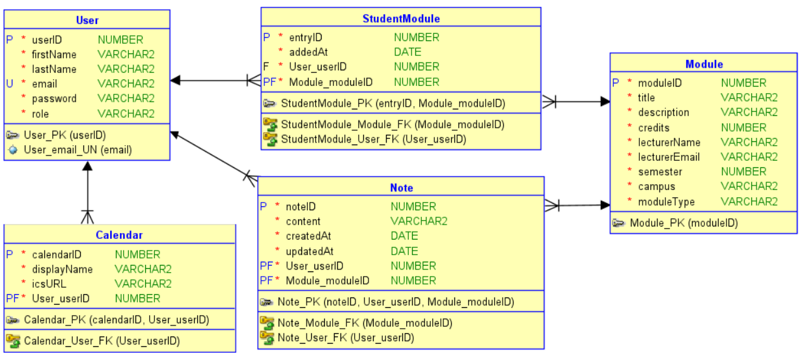

# BIT Semester Planner

A web application for students of the Bachelor of Science in Business
Information Technology (BIT) at FHNW University of Applied Sciences
and Arts Northwestern Switzerland.

## Group Members

| Name | GitHub Username | Contribution |
|------|----------------|--------------|
| Sayeed Sadman | @sayeed-sadman | |
| Eva Siegenthaler | @evasiegenthaler | |
| Kesanet Girmay | @Kesanet | |
| Renjita B R | @RenjitaBR | |

## Links
- Video Presentation: *to be added*
- Web Application: *to be added*
- OpenAPI Documentation: *to be added*

---

## Project Description

### Motivation
Students in the BIT program at FHNW rely on multiple digital platforms
to manage their academic activities. Module information is scattered
across Moodle, the university website, and verbal announcements during
lectures. Personal notes end up in separate documents, and academic
commitments are tracked in external calendars — making it difficult to
maintain a clear overview of semester responsibilities.

### Solution
BIT Semester Planner is a web application that centralizes official BIT
module information, personal module notes, and calendar events in one
place. It enables students to plan their semester efficiently with fewer
system switches and less risk of missing important information.

### Key Features
- **Module Planning** — Browse the official BIT module catalog and build
  a personal semester plan
- **Personal Notes** — Add and manage private notes linked to each module
- **Calendar Integration** — Connect any ICS-compatible calendar (Outlook,
  Google, Apple) via a URL and view events in a weekly overview

---

## 1. Analysis

### Use Case Diagram

### User Stories

#### Authentication

| # | Role | User Story |
|---|------|------------|
| US-01 | Admin | As an admin, I want to log into the system so that I can manage the official BIT module catalog. |
| US-02 | Student | As a student, I want to register for the system so that I can access my personal semester planner features. |
| US-03 | Student | As a student, I want to log into the system so that I can access my saved planner entries, module notes, and calendar overview. |

#### General

| # | Role | User Story |
|---|------|------------|
| US-04 | Both | As a user, I want to access a public landing page so that I can learn about the application before registering. |
| US-05 | Both | As a user, I want to use the application on different mobile devices and desktop computers so that I can access it from anywhere. |
| US-06 | Both | As a user, I want to see a consistent visual appearance across all pages so that I can navigate easily. |
| US-07 | Both | As a user, I want to edit my profile information so that I can keep my personal details up to date. |

#### BIT Module Catalog

| # | Role | User Story |
|---|------|------------|
| US-08 | Admin | As an admin, I want to see a list of all BIT modules so that I can manage the official module catalog. |
| US-09 | Admin | As an admin, I want to filter modules by semester and elective status so that I can quickly find specific modules to maintain. |
| US-10 | Admin | As an admin, I want to open a module detail page so that I can review the official module information before making changes. |
| US-11 | Admin | As an admin, I want to create a new module entry so that newly offered modules can be added to the official catalog. |
| US-12 | Admin | As an admin, I want to edit an existing module so that incorrect or outdated information can be updated. |
| US-13 | Admin | As an admin, I want to delete a module so that obsolete or no longer relevant modules can be removed from the catalog. |
| US-14 | Student | As a student, I want to see a list of all BIT modules so that I can explore available courses. |
| US-15 | Student | As a student, I want to filter modules by semester and elective status so that I can quickly find relevant modules. |
| US-16 | Student | As a student, I want to open a module detail page so that I can view the official module information. |
| US-17 | Student | As a student, I want to add a module to my semester planner so that I can organize my semester plan. |
| US-18 | Student | As a student, I want to remove a module from my semester planner so that I can update my plan if my course selection changes. |

#### Semester Planner

| # | Role | User Story |
|---|------|------------|
| US-19 | Student | As a student, I want to see my selected modules in a structured semester planner so that I can keep track of my planned courses. |
| US-20 | Student | As a student, I want to view key module details such as title, lecturer, and contact information in the planner so that I can quickly understand each planned module. |
| US-21 | Student | As a student, I want to open the full details of a planned module so that I can access the complete official module information when needed. |
| US-22 | Student | As a student, I want to add personal notes to a module so that I can store important information such as exam rules, bonus points, assignment reminders, and preparation tips. |
| US-23 | Student | As a student, I want to edit or remove my notes so that I can keep my personal module information up to date. |
| US-24 | Student | As a student, I want my notes to remain linked to the corresponding module so that I can easily retrieve them later. |

#### Calendar Overview

| # | Role | User Story |
|---|------|------------|
| US-25 | Student | As a student, I want to connect one or more ICS-compatible calendars via a URL so that I can access my existing events inside the application. |
| US-26 | Student | As a student, I want the application to display events from all connected calendars in one weekly view so that I have a consolidated overview of my commitments. |
| US-27 | Student | As a student, I want to see overlapping events across my connected calendars so that I can detect conflicts and plan my time better. |
| US-28 | Student | As a student, I want the calendar view to be read-only so that event creation, updates, and deletions remain managed in my external calendar applications. |

#### Business Rule

| # | Role | User Story |
|---|------|------------|
| US-29 | Student | As a student, I want the system to allow at most two elective modules in my semester plan so that my plan follows the defined elective limit. |

---

### Requirements

#### Functional Requirements

**Authentication & User Management**
- The system must support two user roles: Admin and Student
- Admin accounts are pre-created — only students can self-register
- Students can self-register with first name, last name, email and password
- Students gain immediate access after registration — no admin approval needed
- Both roles must login with email and password
- Both roles can edit their profile (students: name, email, password;
  admin: name and password only — email is fixed)
- The system must redirect users to the correct dashboard based on their
  role after login

**Public Access**
- A public landing page must be accessible without login
- The landing page explains the application and provides Login and
  Sign Up entry points

**BIT Module Catalog — Admin**
- Admin can view a list of all BIT modules with title, semester and
  elective/compulsory status
- Admin can filter modules by semester and by elective/compulsory status
- Admin can view the full detail of any module
- Admin can create a new module with the following attributes: title,
  description, credits, lecturer name, lecturer email, semester, campus
  location, module type (elective/compulsory)
- Admin can edit each attribute of an existing module with confirmation
  before saving
- Admin can delete a module from the catalog with a confirmation popup

**BIT Module Catalog — Student**
- Students can browse the full BIT module catalog with the same list
  view and filter options as admin
- Students can view the full detail of any module (read-only)
- Students can add a module to their personal semester plan directly
  from the catalog
- Students can remove a module from their personal semester plan
  directly from the catalog
- The system must visually distinguish between already-added and
  not-yet-added modules (Add vs Remove button)

**Semester Planner — Student**
- Students can view all modules added to their personal semester plan
  on the Student Dashboard
- Each module in the planner shows: title, semester, module type
- Students can view the full module description from within the planner
  (read-only)
- Students can remove a module directly from the planner with
  confirmation
- Students can open a notes popup per module showing the module title,
  lecturer name and lecturer email as header
- Students can add, edit and remove a personal text note per module
- The system must enforce the business rule: a maximum of 2 elective
  modules are allowed in the semester plan. Any attempt to add a third
  elective must be blocked with a clear message

**Calendar Overview — Student**
- Students can connect one or more ICS-compatible calendars (Outlook,
  Google, Apple or any ICS-feed) by pasting a URL and providing a
  display name
- Connected calendars are saved and immediately display events upon
  connection
- Students can select which calendars to display: all calendars or a
  specific one via a dropdown
- The system displays a read-only weekly view of calendar events for
  the current week
- Students can navigate between weeks using previous/next arrows
- Overlapping events across calendars are highlighted or shown side
  by side so students can detect conflicts
- Students cannot create, edit or delete calendar events inside the
  application — event management remains in the external calendar

---

#### Non-Functional Requirements

**Architecture**
*(Assessment §2.2 — Strict Generic Requirement)*
- The application must reflect at least three different layers on at
  least two tiers:
  - Frontend tier: React full-code application
  - Backend tier: Presentation/Controller layer (@RestController),
    Business/Service layer (@Service), Persistence layer
    (@Repository + @Entity)

**Views**
*(Assessment §2.2 — Strict Generic Requirement)*
- The application must realize all user stories with at least four
  different views. The BIT Semester Planner implements 11 distinct
  pages exceeding this requirement

**Design Principles**
*(Assessment §2.3 — Constraint / L1.3, L4.2)*
- The application must apply OOP, design and architectural patterns,
  API design principles, routing functionalities, DRY and CRUD paradigm

**Web Design**
*(Assessment §2.3 — Constraint / L2.1 Web Engineering and Design)*
- The application must have a consistent visual identity across all pages
- The design must be carefully crafted with adequate user experience,
  qualitative graphics, responsive layout and well-chosen typography
- The application must be usable on both mobile devices and desktop
  computers

**Frontend Technology**
*(Assessment §2.3 — Constraint / L2.3 Low-Code/No-Code)*
- The frontend is implemented as a full-code React application
- UI designs are first created in Figma to define layout, visual
  identity and component structure across all 11 pages
- The Figma designs are then translated into React code
- This full-code approach is justified by the complexity of the
  calendar integration (ICS parsing, weekly view rendering, conflict
  detection) and the custom UI requirements that cannot be adequately
  achieved using a low-code tool such as Budibase

**Backend Technology**
*(Assessment §2.3 — Constraint / L4.1, L4.2)*
- The backend must be implemented using Spring Boot 3.5 and at least
  Java 17
- The backend exposes a REST API consumed by the React frontend

**Database Technology**
*(Assessment §2.3 — Constraint / L5.2, L5.3)*
- H2 is used as a file-based relational database ensuring data
  persistence between application restarts
- The database schema consists of 5 entities:
  User, Module, StudentModule, Note, Calendar

**Security**
*(Assessment §2.5 Milestone 6 / L1.2)*
- API-level security is implemented using HTTP Basic Authentication
- Protected endpoints require authentication
- Public endpoints (landing page, module catalog read) are accessible
  without authentication

**API Documentation**
*(Assessment §2.3 — Constraint / L3.1, L3.2)*
- All API endpoints must be documented using OpenAPI 3.0 (Swagger)
- The Swagger UI must be accessible from the running application

**Source Code & Version Control**
*(Assessment §2.3 — Constraint)*
- All source code and artefacts are version-controlled on GitHub
- The repository is actively maintained with meaningful commit history
  throughout the development process
- Branch protection is enforced: all changes to main require at least
  one pull request review before merging

**Deployment**
*(Assessment §2.4 — Deliverables)*
- The application must be configured and running on GitHub Codespaces
- The application must be reproducible — any team member or evaluator
  must be able to start the application from the repository

---

## 2. Domain Design

### Domain Model

The BIT Semester Planner is built around five core entities that reflect
the business domain of academic module planning, personal note management
and calendar integration.

### Entities

#### User
Represents both Admin and Student accounts in the system. The role field
determines which features and views the user can access after login.

| Attribute | Type | Description |
|-----------|------|-------------|
| userID | Long | Primary key, auto-generated |
| firstName | String | User's first name |
| lastName | String | User's last name |
| email | String | Unique email address used for login |
| password | String | Encrypted password |
| role | Enum | Either ADMIN or STUDENT |

#### Module
Represents an official BIT module entry in the catalog. Only Admin can
create, edit or delete modules. Students can only read module data.

| Attribute | Type | Description |
|-----------|------|-------------|
| moduleID | Long | Primary key, auto-generated |
| title | String | Official module title |
| description | String | Full module description |
| credits | Integer | Number of ECTS credits |
| lecturerName | String | Name of the responsible lecturer |
| lecturerEmail | String | Email address of the lecturer |
| semester | Integer | Semester number the module is assigned to |
| campus | String | Campus location |
| moduleType | Enum | Either ELECTIVE or COMPULSORY |

#### StudentModule
Represents the relationship between a Student and a Module in their
personal semester plan. Acts as a join table with additional metadata.

| Attribute | Type | Description |
|-----------|------|-------------|
| entryID | Long | Primary key, auto-generated |
| student | User | Reference to the student (ManyToOne) |
| module | Module | Reference to the module (ManyToOne) |
| addedAt | LocalDateTime | Timestamp when the module was added |

#### Note
Represents a personal text note written by a student for a specific
module in their semester plan. Each student can have at most one note
per module.

| Attribute | Type | Description |
|-----------|------|-------------|
| noteID | Long | Primary key, auto-generated |
| student | User | Reference to the note's author (ManyToOne) |
| module | Module | Reference to the linked module (ManyToOne) |
| content | String | Free text note content |
| createdAt | LocalDateTime | Timestamp when the note was created |
| updatedAt | LocalDateTime | Timestamp when the note was last edited |

#### Calendar
Represents an ICS-compatible calendar connected by a student via a URL.
A student can connect multiple calendars with different display names.

| Attribute | Type | Description |
|-----------|------|-------------|
| calendarID | Long | Primary key, auto-generated |
| student | User | Reference to the calendar owner (ManyToOne) |
| displayName | String | User-defined name for the calendar |
| icsURL | String | The ICS feed URL provided by the student |

### Relationships

| Relationship | Type | Description |
|-------------|------|-------------|
| User → StudentModule | One-to-Many | One student can have many planned modules |
| Module → StudentModule | One-to-Many | One module can appear in many students' plans |
| User → Note | One-to-Many | One student can have many notes |
| Module → Note | One-to-Many | One module can have many notes (from different students) |
| User → Calendar | One-to-Many | One student can connect many calendars |

### Logical Model

### Relational Model

### Business Rule
A student may add a maximum of **2 elective modules** to their semester
plan. This rule is enforced in the Business/Service layer when a student
attempts to add a module with moduleType = ELECTIVE. If the student
already has 2 elective modules in their plan, the request is rejected
and an appropriate message is returned to the frontend.

---

## 3. Frontend Design
*to be added*

---

## 4. Business Logic & API Design
*to be added*

---

## 5. Data & API Implementation
*to be added*

---

## 6. Security
*to be added*

---

## 7. Demonstrator
*to be added*
