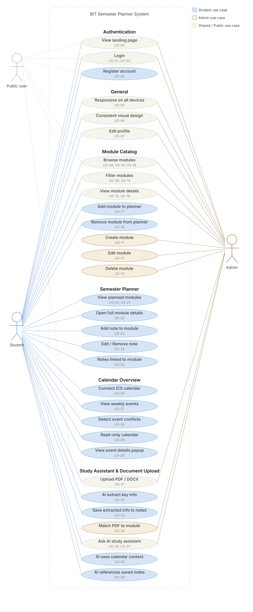
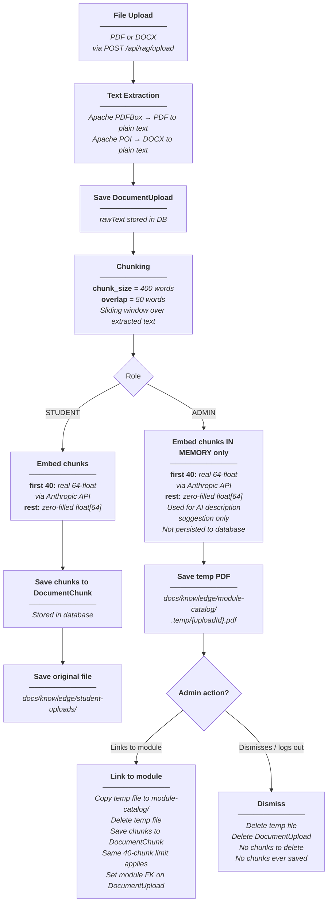
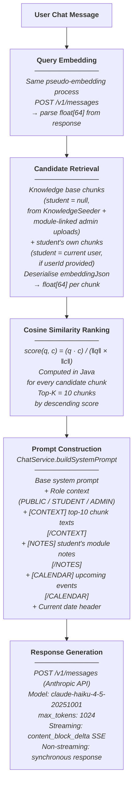

# BIT Semester Planner

BIT Semester Planner is a web application for FHNW Business Information Technology students to plan their semester, manage module notes, connect external calendars, and interact with an AI study assistant backed by a RAG pipeline.

## Group Members (Basel-11)

| Name | GitHub Username | Contribution |
|------|----------------|--------------|
| Sayeed Sadman | `@sayeed-sadman` | Full-stack development, system architecture, backend implementation, REST API design, AI/RAG integration, deployment and project coordination |
| Eva Siegenthaler | `@evasiegenthaler` | UI/UX design, Figma prototyping, frontend design review and user experience feedback |
| Kesanet Girmay | `@Kesanet` | Data model design, domain entity definition, database schema review and data architecture feedback |
| Renjita Byju Resmi | `@RenjitaBR` | Security design review, authentication and role-based access control specification, API security feedback |

## Links
- **Video Presentation:**  [bit-semester-planner](https://fhnw365-my.sharepoint.com/:v:/r/personal/sayeed_sadman_students_fhnw_ch/Documents/Group%20Work/4th%20Semester/Internet%20Technology/Video%20Presentation/Basel%2011_bit-semester-planner.mp4?csf=1&web=1&e=nRJHcx&nav=eyJyZWZlcnJhbEluZm8iOnsicmVmZXJyYWxBcHAiOiJTdHJlYW1XZWJBcHAiLCJyZWZlcnJhbFZpZXciOiJTaGFyZURpYWxvZy1MaW5rIiwicmVmZXJyYWxBcHBQbGF0Zm9ybSI6IldlYiIsInJlZmVycmFsTW9kZSI6InZpZXcifX0%3D) (FHNW organisation account required!!!)
- **Web Application:** Runs on GitHub Codespaces - See [Section 7](#7-demonstrator) for instructions
- **OpenAPI Documentation:** `https://{codespace-name}-8080.app.github.dev/swagger-ui.html`

---

## Table of Contents

- [1. Analysis](#1-analysis)
  - [1.1 Scenario & Use Case](#11-scenario--use-case)
  - [1.2 User Stories](#12-user-stories)
  - [1.3 Functional Requirements](#13-functional-requirements)
  - [1.4 Non-Functional Requirements](#14-non-functional-requirements)

- [2. Domain Design](#2-domain-design)
  - [2.1 Domain Model](#21-domain-model)
  - [2.2 Entity Descriptions](#22-entity-descriptions)

- [3. Frontend Implementation](#3-frontend-implementation)
  - [3.1 Technology Choice](#31-technology-choice)
  - [3.2 Design & Prototyping](#32-design--prototyping)
  - [3.3 Application Views](#33-application-views)

- [4. Business Logic & API Design](#4-business-logic--api-design)
  - [4.1 Business Rules](#41-business-rules)
  - [4.2 API Design Principles](#42-api-design-principles)
  - [4.3 API Endpoints](#43-api-endpoints)

- [5. Data & API Implementation](#5-data--api-implementation)
  - [5.1 Database Configuration](#51-database-configuration)
  - [5.2 Data Access Layer](#52-data-access-layer)
  - [5.3 Architecture Overview](#53-architecture-overview)
  - [5.4 Error Handling](#54-error-handling)
  - [5.5 Backend Technology Stack](#55-backend-technology-stack)

- [6. Security](#6-security)
  - [6.1 Authentication (Basic Auth)](#61-authentication-basic-auth)
  - [6.2 Role-Based Access Control](#62-role-based-access-control)

- [7. Demonstrator](#7-demonstrator)
  - [7.1 How to Run on GitHub Codespaces](#71-how-to-run-on-github-codespaces)
  - [7.2 How to Run Locally](#72-how-to-run-locally)
  - [7.3 Application URLs and Credentials](#73-application-urls-and-credentials)
  - [7.4 End-to-End Walkthrough](#74-end-to-end-walkthrough)

- [8. AI Study Assistant & RAG](#8-ai-study-assistant--rag)
  - [8.1 Overview](#81-overview)
  - [8.2 RAG Pipeline](#82-rag-pipeline)

- [9. Calendar Integration](#9-calendar-integration)
  - [9.1 How It Works](#91-how-it-works)
  - [9.2 ICS Parsing & Overlap Detection](#92-ics-parsing--overlap-detection)

---

## 1. Analysis

### 1.1 Scenario & Use Case

BIT students at FHNW manage their academic life across multiple disconnected platforms. Module information is scattered across Moodle and the university website, personal notes live in separate documents, and schedules are tracked in external calendars. BIT Semester Planner brings all of this into one place: students can build a personal semester plan from the official module catalogue, write and retrieve notes per module, connect their existing ICS calendars for a consolidated weekly view, and get contextual study help from an AI assistant that understands their modules, documents, and schedule. Admins maintain the official module catalogue and can use the AI assistant to update module entries directly from uploaded documents.

**Figure 1: Use Case Diagram**



### 1.2 User Stories

#### Authentication

| Code | Role | User Story |
|------|------|------------|
| `US-01` | Admin | As an admin, I want to log into the system so that I can manage the official BIT module catalog. |
| `US-02` | Student | As a student, I want to register for the system so that I can access my personal semester planner features. |
| `US-03` | Student | As a student, I want to log into the system so that I can access my saved planner entries, module notes, and calendar overview. |

#### General

| Code | Role | User Story |
|------|------|------------|
| `US-04` | Both | As a user, I want to access a public landing page so that I can learn about the application before registering. |
| `US-05` | Both | As a user, I want to use the application on different mobile devices and desktop computers so that I can access it from anywhere. |
| `US-06` | Both | As a user, I want to see a consistent visual appearance across all pages so that I can navigate easily. |
| `US-07` | Both | As a user, I want to edit my profile information so that I can keep my personal details up to date. |

#### BIT Module Catalog

| Code | Role | User Story |
|------|------|------------|
| `US-08` | Admin | As an admin, I want to see a list of all BIT modules so that I can manage the official module catalog. |
| `US-09` | Admin | As an admin, I want to filter modules by semester and elective status so that I can quickly find specific modules to maintain. |
| `US-10` | Admin | As an admin, I want to open a module detail page so that I can review the official module information before making changes. |
| `US-11` | Admin | As an admin, I want to create a new module entry so that newly offered modules can be added to the official catalog. |
| `US-12` | Admin | As an admin, I want to edit an existing module so that incorrect or outdated information can be updated. |
| `US-13` | Admin | As an admin, I want to delete a module so that obsolete or no longer relevant modules can be removed from the catalog. |
| `US-14` | Student | As a student, I want to see a list of all BIT modules so that I can explore available courses. |
| `US-15` | Student | As a student, I want to filter modules by semester and elective status so that I can quickly find relevant modules. |
| `US-16` | Student | As a student, I want to open a module detail page so that I can view the official module information. |
| `US-17` | Student | As a student, I want to add a module to my semester planner so that I can organize my semester plan. |
| `US-18` | Student | As a student, I want to remove a module from my semester planner so that I can update my plan if my course selection changes. |
| `US-19` | Public | As an unauthenticated visitor, I want to browse the module catalog and view module details without logging in so that I can explore available BIT modules before deciding to register. |

#### Semester Planner

| Code | Role | User Story |
|------|------|------------|
| `US-20` | Student | As a student, I want to see my selected modules in a structured semester planner so that I can keep track of my planned courses. |
| `US-21` | Student | As a student, I want to view key module details such as title, lecturer, and contact information in the planner so that I can quickly understand each planned module. |
| `US-22` | Student | As a student, I want to open the full details of a planned module so that I can access the complete official module information when needed. |
| `US-23` | Student | As a student, I want to add personal notes to a module so that I can store important information such as exam rules, bonus points, assignment reminders, and preparation tips. |
| `US-24` | Student | As a student, I want to edit or remove my notes so that I can keep my personal module information up to date. |
| `US-25` | Student | As a student, I want my notes to remain linked to the corresponding module so that I can easily retrieve them later. |

#### Calendar Overview

| Code | Role | User Story |
|------|------|------------|
| `US-26` | Student | As a student, I want to connect one or more ICS-compatible calendars via a URL so that I can access my existing events inside the application. |
| `US-27` | Student | As a student, I want the application to display events from all connected calendars in one weekly view so that I have a consolidated overview of my commitments. |
| `US-28` | Student | As a student, I want to see overlapping events across my connected calendars so that I can detect conflicts and plan my time better. |
| `US-29` | Student | As a student, I want the calendar view to be read-only so that event creation, updates, and deletions remain managed in my external calendar applications. |
| `US-30` | Student | As a student, I want to click on a calendar event to see its full details in a popup so that I can view the event title, date, time, and calendar name without leaving the dashboard. |

#### Study Assistant & Document Upload

| Code | Role | User Story |
|------|------|------------|
| `US-31` | Both | As a student or admin, I want to upload a PDF or DOCX so that the AI can analyse its content. |
| `US-32` | Student | As a student, I want the AI to extract exam dates, deadlines, and grading from my upload so that I can quickly capture key information from lecture documents. |
| `US-33` | Student | As a student, I want to save the extracted information directly to my module notes so that I do not have to copy it manually. |
| `US-34` | Admin | As an admin, I want the system to match an uploaded PDF to an existing module so that I can update the module catalogue with accurate information. |
| `US-35` | Both | As a student or admin, I want to ask the AI study assistant questions about my modules and receive streamed answers so that I get immediate, contextual responses. |
| `US-36` | Student | As a student, I want the chatbot to be aware of my calendar events when answering scheduling questions so that its responses reflect my actual commitments. |
| `US-37` | Public | As an unauthenticated visitor, I want to ask the AI study assistant general questions about FHNW and the BIT programme so that I can learn about the programme before registering. |
| `US-38` | Student | As a student, I want the AI assistant to reference my saved module notes when answering questions so that I can ask about note content even after deleting the uploaded document. |

### 1.3 Functional Requirements

| Code | Functional Requirement |
|------|------------------------|
| `FR-01` | The system shall support two user roles: Admin and Student. |
| `FR-02` | Students shall be able to self-register using first name, last name, email, and password. |
| `FR-03` | Admin accounts cannot be created through the self-registration flow. |
| `FR-04` | All users shall authenticate using email and password. |
| `FR-05` | All users shall be able to update their name and password. Students may also update their email. |
| `FR-06` | Password changes shall require the current password. |
| `FR-07` | Students shall be able to permanently delete their own account. |
| `FR-08` | After login, users are redirected based on their role. |
| `FR-09` | The module catalogue shall be publicly accessible without login. |
| `FR-10` | All users shall view module details including title, credits, semester, campus, and type. |
| `FR-11` | Both roles shall filter modules by semester and type. |
| `FR-12` | Admins shall create, edit, and delete modules. |
| `FR-13` | Students shall add modules to their semester plan. |
| `FR-14` | Students shall remove modules from their semester plan. |
| `FR-15` | The system shall enforce a maximum of 2 elective modules per plan. |
| `FR-16` | The planner shall display each module with title, semester, and type. |
| `FR-17` | Students shall create and edit a personal note per module. |
| `FR-18` | Each student has at most one note per module. Saving when one exists updates it. |
| `FR-19` | Removing a module from the plan automatically deletes its note. |
| `FR-20` | Notes shall be accessible from both the dashboard and a dedicated full-page editor. |
| `FR-21` | Students shall connect ICS calendar feeds by providing a URL and display name. |
| `FR-22` | The system shall display events from connected calendars in a read-only weekly view. |
| `FR-23` | Students shall navigate between weeks to view past and future events. |
| `FR-24` | The system shall detect and visually highlight overlapping calendar events. |
| `FR-25` | Calendar events are read-only within the application. |
| `FR-26` | An AI study assistant shall be available on every page including public pages. |
| `FR-27` | The assistant shall answer questions related to FHNW, BIT modules, documents, and deadlines. |
| `FR-28` | The assistant shall take the student's calendar events into account for scheduling questions. |
| `FR-29` | Chat history is retained for the browser session and cleared when the browser is closed. |
| `FR-30` | Students and admins shall upload PDF and DOCX files for AI-assisted analysis. |
| `FR-31` | The system shall extract exam dates, deadlines, grading, credits, and lecturer details from uploads. |
| `FR-32` | Students shall save extracted information directly to a module note. |
| `FR-33` | Admins shall match an uploaded document to an existing module and apply extracted information. |
| `FR-34` | Admins shall use extracted content to pre-fill a new module creation form. |
| `FR-35` | Students and admins shall view and delete their previously uploaded documents. |

### 1.4 Non-Functional Requirements

| Code | Non-Functional Requirement |
|------|---------------------------|
| `NFR-01` | Three-layer architecture across two tiers: React SPA frontend and Spring Boot backend. |
| `NFR-02` | Frontend and backend communicate exclusively via a RESTful HTTP API. |
| `NFR-03` | The application provides more than four distinct views as required by the assessment. |
| `NFR-04` | The application is usable on desktop and mobile through a responsive layout. |
| `NFR-05` | Consistent visual identity across all pages: typography, colour scheme, and component style. |
| `NFR-06` | All destructive actions require explicit user confirmation before execution. |
| `NFR-07` | Streamed AI responses provide continuous feedback to minimise perceived waiting time. |
| `NFR-08` | All business rules are enforced server-side and cannot be bypassed via the UI or API. |
| `NFR-09` | Application data persists between restarts using a file-based H2 database. |
| `NFR-10` | All protected endpoints require authentication. Unauthenticated requests are rejected. |
| `NFR-11` | Admin-only and Student-only operations are enforced by role-based access control. |
| `NFR-12` | Passwords are stored as BCrypt hashes. Plain-text passwords are never stored or logged. |
| `NFR-13` | Secure communication is supported across deployment environments. |
| `NFR-14` | The application applies DRY, separation of concerns, and the CRUD paradigm. |
| `NFR-15` | The database schema comprises 7 entities with referential integrity and cascade rules. |
| `NFR-16` | Unique constraints prevent duplicate emails and duplicate module entries per student plan. |
| `NFR-17` | All API endpoints are documented using OpenAPI 3.0 and accessible via Swagger UI. |
| `NFR-18` | The application deploys on GitHub Codespaces with both services starting automatically. |
| `NFR-19` | The application is fully reproducible from the repository with no extra configuration. |
| `NFR-20` | All source code and artefacts are maintained under Git version control. |

---

## 2. Domain Design

### 2.1 Domain Model

The application is built around seven entities. The `User` entity covers both Admin and Student accounts, distinguished by role. `Module` holds the official BIT module catalogue. `StudentModule` links a student to the modules they have added to their plan, while `Note` stores their personal text note per planned module. `StudentCalendar` records the ICS feed connections a student has set up. `DocumentUpload` and `DocumentChunk` support the AI pipeline by storing uploaded files and their extracted text segments used for contextual retrieval.

**Figure 2: Domain Model Diagram**



### 2.2 Entity Descriptions

**Domain Entities**

| Entity | Purpose |
|--------|---------|
| `User` | Represents both Admin and Student accounts, differentiated by role. |
| `Module` | Holds the official BIT module catalogue managed by admins. |
| `StudentModule` | Links a student to the modules they have added to their semester plan. |
| `Note` | Stores a student's personal text note for a planned module. |
| `StudentCalendar` | Records the ICS calendar feed connections a student has configured. |
| `DocumentUpload` | Represents a file uploaded by a student or admin for AI-assisted analysis. Optionally linked to a `Module` for admin uploads. |
| `DocumentChunk` | Stores extracted text segments from an uploaded document used for RAG retrieval. |

**Entity Relationships**

| Relationship | Cardinality |
|--------------|-------------|
| `User` to `StudentModule` | One-to-Many |
| `Module` to `StudentModule` | One-to-Many |
| `User` to `Note` | One-to-Many |
| `Module` to `Note` | One-to-Many |
| `User` to `StudentCalendar` | One-to-Many |
| `User` to `DocumentUpload` | One-to-Many |
| `Module` to `DocumentUpload` | One-to-Many (optional, admin uploads only) |
| `DocumentUpload` to `DocumentChunk` | One-to-Many |

---

## 3. Frontend Implementation

### 3.1 Technology Choice

The frontend is built as a full-code React application using Vite as the build tool and Tailwind CSS for styling. A low-code tool such as Budibase was not used because the calendar integration (ICS parsing, weekly view rendering, and conflict detection across multiple feeds) and the streaming AI chat interface require a level of custom logic that cannot be achieved with a low-code approach.

| Technology | Purpose |
|------------|---------|
| `React` | Component-based UI library for building the single-page application |
| `Vite` | Build tool and development server; proxies `/api/*` requests to the backend |
| `React Router DOM` | Client-side routing and role-based route protection |
| `Axios` | HTTP client; handles Basic Auth injection and 401 redirects |
| `Tailwind CSS` | Utility-first CSS framework for consistent styling and responsive layout |
| `react-markdown` | Renders formatted AI assistant responses in the chat panel |

### 3.2 Design & Prototyping

All 11 pages were designed in Figma before implementation. The Figma file defines the layout, visual identity, component structure, and navigation flow for every page.

**Figma Design File:** [bit-semester-planner](https://www.figma.com/design/T7aUdDUHdcelNOJ3RdERoh/bit-semester-planner)

Frontend code was generated from the Figma design using Claude Code, translating the Figma layouts directly into React components.

**Design System**

| Token | Value | Usage |
|-------|-------|-------|
| Primary Blue | `#2563EB` | Buttons, links, active states |
| Page Background | `#F8FAFD` | All page backgrounds |
| Card Background | `#FFFFFF` | Panel and card surfaces |
| Success Green | `#10B981` | Success states, confirmations |
| Error Red | `#DC2626` | Validation errors, destructive actions |
| Font | `Inter` | All text across all pages |

### 3.3 Application Views

| Route | Role | Description |
|-------|------|-------------|
| `/` | Any | Landing page with application overview and entry points for login and registration. |
| `/login` | Unauthenticated | Email and password login form. |
| `/register` | Unauthenticated | Student self-registration form. |
| `/admin/modules` | Admin | Browse and manage all BIT modules; filter by semester and module type. |
| `/admin/modules/new` | Admin | Create a new module entry in the catalogue. |
| `/admin/modules/:id` | Admin | View, edit, or delete an existing module. |
| `/dashboard` | Student | Personal workspace combining semester planning, notes, calendar, and AI assistant. |
| `/modules` | Any | Browse the full BIT module catalogue with filter options. |
| `/modules/:id` | Any | View module details. Students can add or remove from their plan. Admins can edit or delete. |
| `/notes/:moduleId` | Student | Full-page note editor for a specific planned module. |
| `/profile` | Admin + Student | Edit name and password; students may also update their email or delete their account. |

The application is fully responsive. The student dashboard uses a two-column layout on desktop that stacks to a single column on mobile. All tables are horizontally scrollable on small screens and modals remain centred with appropriate sizing across all breakpoints.

---

## 4. Business Logic & API Design

### 4.1 Business Rules

The following rules are enforced in the service layer. All rules are validated on the server side and cannot be bypassed through the frontend or direct API access.

| Code | Rule | Enforced By | API Response |
|------|------|-------------|--------------|
| `BR-01` | A student may add a maximum of 2 elective modules to their semester plan. | `StudentModuleService` | `400 Bad Request` |
| `BR-02` | The same module cannot be added to a student's plan more than once. | `StudentModuleService` | `409 Conflict` |
| `BR-03` | Each student has at most one note per module. Saving when one exists updates it silently. | `NoteService` | No error (upsert) |
| `BR-04` | An admin's email address cannot be changed after account creation. | `UserService` | No error (field ignored) |
| `BR-05` | Changing a password requires the current password to be provided. | `UserService` | `400 Bad Request` |
| `BR-06` | Removing a module from the semester plan automatically deletes the associated note. | `StudentModuleService` | No error (silent cascade) |
| `BR-07` | A student may only view, modify, or delete their own calendar entries. | `CalendarService` | `404 Not Found` |
| `BR-08` | A student may only delete documents they have uploaded themselves. | `DocumentController` | `403 Forbidden` |
| `BR-09` | Self-registration always creates a Student account. | `UserService` | No error (role hardcoded) |
| `BR-10` | Email addresses must be unique across all user accounts. | `UserService` | `409 Conflict` |

### 4.2 API Design Principles

All endpoints follow these principles consistently:

- **Resource-oriented URLs:** endpoints are named after resources using plural nouns (`/api/modules`, `/api/calendars`). No verb-based paths.
- **HTTP method semantics:** `GET` for retrieval, `POST` for creation, `PUT` for full update, `DELETE` for removal.
- **Stateless authentication:** every request is authenticated independently via HTTP Basic Auth. No server-side sessions.
- **Structured JSON responses:** all responses are JSON. Errors follow a uniform structure with `timestamp`, `status`, `error`, `message`, and `path`.
- **Explicit status codes:** `200`, `201`, `204`, `400`, `401`, `403`, `404`, `409` are used accurately across all endpoints.

### 4.3 API Endpoints

**Authentication**

| Method | Endpoint | Description |
|--------|----------|-------------|
| `POST` | `/api/auth/register` | Register a new student account |
| `GET` | `/api/auth/me` | Get the current authenticated user's profile |
| `PUT` | `/api/auth/me` | Update the current user's profile |
| `DELETE` | `/api/auth/me` | Permanently delete the current student account |

**Modules**

| Method | Endpoint | Description |
|--------|----------|-------------|
| `GET` | `/api/modules` | List all modules; supports filtering by semester and type |
| `GET` | `/api/modules/{id}` | Get a single module by ID |
| `POST` | `/api/modules` | Create a new module (Admin only) |
| `PUT` | `/api/modules/{id}` | Update an existing module (Admin only) |
| `DELETE` | `/api/modules/{id}` | Delete a module (Admin only) |
| `GET` | `/api/modules/{id}/pdf` | Stream the official module description PDF |
| `POST` | `/api/modules/{id}/pdf` | Upload or replace a module description PDF (Admin only) |
| `DELETE` | `/api/modules/{id}/pdf` | Delete the official module description PDF (Admin only) |
| `POST` | `/api/modules/{id}/pdf/from-upload/{uploadId}` | Promote a temp upload to the official module PDF (Admin only) |

**Semester Planner**

| Method | Endpoint | Description |
|--------|----------|-------------|
| `GET` | `/api/planner` | Get all modules in the student's semester plan |
| `POST` | `/api/planner/{moduleId}` | Add a module to the semester plan |
| `DELETE` | `/api/planner/{moduleId}` | Remove a module from the semester plan |
| `GET` | `/api/planner/{moduleId}/status` | Check if a module is already in the plan |

**Notes**

| Method | Endpoint | Description |
|--------|----------|-------------|
| `GET` | `/api/notes/{moduleId}` | Get the student's note for a module |
| `POST` | `/api/notes/{moduleId}` | Create or update a note for a module |
| `DELETE` | `/api/notes/{moduleId}` | Delete a note for a module |

**Calendars**

| Method | Endpoint | Description |
|--------|----------|-------------|
| `GET` | `/api/calendars` | List all connected calendar feeds |
| `POST` | `/api/calendars` | Connect a new ICS calendar feed |
| `DELETE` | `/api/calendars/{id}` | Remove a connected calendar |
| `GET` | `/api/calendars/{id}/events` | Fetch events from a single calendar |
| `GET` | `/api/calendars/events/all` | Fetch and merge events from all calendars with overlap detection |

**Chat & RAG**

| Method | Endpoint | Description |
|--------|----------|-------------|
| `POST` | `/api/chat` | Submit a question to the AI assistant |
| `POST` | `/api/chat/stream` | Submit a question and receive a streamed SSE response |
| `POST` | `/api/rag/upload` | Upload a PDF or DOCX for AI analysis |
| `GET` | `/api/rag/uploads` | List all uploaded documents |
| `GET` | `/api/rag/uploads/{id}/file` | View or download the original uploaded file (Student only) |
| `DELETE` | `/api/rag/uploads/{id}` | Delete an uploaded document and its file and chunks |
| `DELETE` | `/api/rag/uploads/unlinked` | Delete all unlinked temp uploads for the current user (called on logout) |
| `GET` | `/api/rag/match-module` | Find the best matching module for a document title (Admin only) |

**Programme Resources**

| Method | Endpoint | Description |
|--------|----------|-------------|
| `GET` | `/api/programme-docs` | List all programme documents grouped by section (public) |
| `GET` | `/api/programme-docs/{section}/{filename}` | Serve a programme document file (public) |
| `POST` | `/api/programme-docs/{section}` | Upload a new programme document (Admin only) |
| `DELETE` | `/api/programme-docs/{section}/{filename}` | Delete a programme document and its RAG chunks (Admin only) |

**OpenAPI Documentation**

All endpoints are documented using OpenAPI 3.0 via `springdoc-openapi`. The interactive Swagger UI is available at `/swagger-ui.html` on the running application and requires no login. The raw API specification is accessible at `/api-docs`.

---

## 5. Data & API Implementation

### 5.1 Database Configuration

The application uses an H2 embedded relational database in file-backed mode. Data persists across application restarts without requiring an external database server.

| Setting | Value |
|---------|-------|
| Engine | H2 (embedded, file-based) |
| Location | `./data/bitsemesterplanner` |
| DDL Management | `hibernate.ddl-auto=update` |
| H2 Console | Enabled at `/h2-console` |
| Timezone | `Europe/Zurich` |
| File Upload Limit | 20 MB per file |

**Seed Data**

Two startup components seed the database on first run. Both are idempotent and skip records that already exist.

- `DataInitializer` seeds two default user accounts (`admin@fhnw.ch` and `student@fhnw.ch`) and 8 BIT modules if the module table is empty.
- `KnowledgeSeeder` scans `docs/knowledge/module-catalog/` for official module PDFs and each subfolder of `docs/knowledge/programme/` for BIT programme reference documents. Each chunk is prefixed with its source section label so the RAG agent understands where the content comes from.

Five file storage directories are used at runtime:

| Directory | Purpose |
|-----------|---------|
| `docs/knowledge/module-catalog/` | Official module description PDFs, served publicly and indexed for RAG retrieval for all users |
| `docs/knowledge/module-catalog/.temp/` | Temporary admin uploads awaiting module linking; cleaned up on logout or dismiss |
| `docs/knowledge/programme/administrative/` | BIT administrative documents (bachelor thesis info, semester plans); indexed for RAG |
| `docs/knowledge/programme/compulsory/` | Compulsory module overview documents; indexed for RAG |
| `docs/knowledge/programme/elective/` | Elective module list documents; indexed for RAG |
| `docs/knowledge/programme/specialization/` | Specialization brochures; indexed for RAG |
| `docs/knowledge/student-uploads/` | Original PDF and DOCX files uploaded by students; served back via the My Documents viewer and indexed for RAG retrieval for students |

### 5.2 Data Access Layer

Each domain entity maps to a database table via JPA. Seven repository interfaces extend `JpaRepository` to provide CRUD operations without manual SQL.

| Entity | Table | Key Attributes |
|--------|-------|----------------|
| `User` | `app_user` | `userID`, `email` (unique), `password` (BCrypt), `role` |
| `Module` | `module` | `moduleID`, `title`, `credits`, `semester`, `moduleType` |
| `StudentModule` | `student_module` | `entryID`, `student_id`, `module_id`, `addedAt` |
| `Note` | `note` | `noteID`, `student_id`, `module_id`, `content`, `updatedAt` |
| `StudentCalendar` | `student_calendar` | `calendarID`, `student_id`, `displayName`, `icsURL` |
| `DocumentUpload` | `document_upload` | `id`, `student_id` (nullable), `module_id` (nullable), `fileName`, `rawText` |
| `DocumentChunk` | `document_chunk` | `id`, `document_upload_id`, `chunkText`, `embeddingJson` |

### 5.3 Architecture Overview

The backend follows a three-layer architecture across two tiers. All dependencies flow top-down: controllers depend on services, services depend on repositories.

| Layer | Responsibility | Components |
|-------|---------------|------------|
| Presentation | Accepts HTTP requests, delegates to services, returns responses | `AuthController`, `ModuleController`, `StudentModuleController`, `NoteController`, `CalendarController`, `ChatController`, `DocumentController` |
| Business Logic | Enforces business rules, coordinates data access | `UserService`, `ModuleService`, `StudentModuleService`, `NoteService`, `CalendarService`, `RagService`, `ChatService`, `ExtractionService` |
| Persistence | Maps entities to database tables, provides CRUD via repository interfaces | `UserRepository`, `ModuleRepository`, `StudentModuleRepository`, `NoteRepository`, `StudentCalendarRepository`, `DocumentUploadRepository`, `DocumentChunkRepository` |

**Architectural Patterns**

| Pattern | Purpose |
|---------|---------|
| MVC | Controllers handle HTTP, services own business logic, repositories abstract data access. No layer bypasses this hierarchy. |
| Repository | Seven Spring Data JPA interfaces extend `JpaRepository`, providing full CRUD without manual SQL. |
| DTO | Dedicated transfer objects (`ChatRequest`, `ChatResponse`, `CalendarEventDTO`, `ErrorResponse`) are used at controller boundaries. Domain entities are never exposed directly. |
| Constructor Injection | All controllers and services declare dependencies as constructor parameters. No `@Autowired` field injection is used. |
| Global Exception Handling | `GlobalExceptionHandler` (`@ControllerAdvice`) maps all application exceptions to structured `ErrorResponse` objects with appropriate HTTP status codes. |
| Startup Initialisation | `@PostConstruct` methods in `DataInitializer` and `KnowledgeSeeder` ensure the application starts in a consistent, usable state. |

### 5.4 Error Handling

A `@ControllerAdvice` class (`GlobalExceptionHandler`) intercepts exceptions thrown from any layer and maps them to structured JSON error responses with appropriate HTTP status codes.

**Exception to Status Mappings**

| Exception | HTTP Status |
|-----------|-------------|
| `EntityNotFoundException` | `404 Not Found` |
| `BusinessRuleException` | `400 Bad Request` |
| `DuplicateEntryException` | `409 Conflict` |
| `AccessDeniedException` | `403 Forbidden` |
| `IllegalArgumentException` | `400 Bad Request` |
| `Exception` (catch-all) | `500 Internal Server Error` |

**ErrorResponse Structure**

| Field | Type | Purpose |
|-------|------|---------|
| `timestamp` | `LocalDateTime` | Date and time at which the error occurred |
| `status` | `int` | HTTP status code as an integer |
| `error` | `String` | HTTP status reason phrase (e.g. `"Not Found"`) |
| `message` | `String` | Human-readable description of the specific error |
| `path` | `String` | Request URI that triggered the error |

**Example Response (404 Not Found)**

```json
{
  "timestamp": "2026-05-30T10:15:42",
  "status": 404,
  "error": "Not Found",
  "message": "Module not found with ID: 99",
  "path": "/api/modules/99"
}
```

### 5.5 Backend Technology Stack

| Technology | Purpose |
|------------|---------|
| `Spring Boot 3` | Application framework; provides runtime, auto-configuration, and embedded server |
| `Spring Security` | HTTP Basic Authentication, role-based access control, and CORS configuration |
| `Spring Data JPA / Hibernate` | ORM and repository layer for all 7 entities |
| `H2` | Embedded file-based relational database |
| `springdoc-openapi` | Auto-generates OpenAPI 3.0 documentation at `/swagger-ui.html` |
| `ical4j` | Fetches and parses ICS calendar feeds |
| `Anthropic Claude API` | Chat responses, pseudo-embedding generation, and document extraction |
| `Apache PDFBox` | Extracts plain text from PDF uploads |
| `Apache POI` | Extracts plain text from DOCX uploads |

---

## 6. Security

### 6.1 Authentication (Basic Auth)

The application uses HTTP Basic Authentication via Spring Security. On every request, the client sends Base64-encoded `email:password` credentials in the `Authorization` header. The backend validates them against the database on each call and compares the provided password against the stored BCrypt hash. No server-side sessions are maintained.

Additional configuration in `SecurityConfig.java`:

- CSRF protection is disabled, appropriate for a stateless REST API.
- H2 Console iframe rendering is permitted within the same origin for development.
- Passwords are hashed using **BCrypt** via `BCryptPasswordEncoder`. Plain-text passwords are never stored or logged.
- CORS is configured to allow any origin (`allowedOriginPatterns: *`), with `GET`, `POST`, `PUT`, `DELETE`, and `OPTIONS` methods permitted and `allowCredentials: true` to support Basic Auth headers from the React frontend.

### 6.2 Role-Based Access Control

Access to each endpoint group is governed by Spring Security rules enforced in `SecurityConfig.java`.

| Endpoint Group | Auth Required | Role |
|----------------|--------------|------|
| `GET /api/modules`, `GET /api/modules/{id}` | No | Public |
| `POST /api/auth/register` | No | Public |
| `POST /api/chat`, `POST /api/chat/stream` | No | Public |
| `/swagger-ui.html`, `/api-docs/**` | No | Public |
| `POST /api/modules`, `PUT /api/modules/**`, `DELETE /api/modules/**` | Yes | Admin only |
| `GET /api/rag/match-module` | Yes | Admin only |
| `/api/planner/**`, `/api/notes/**`, `/api/calendars/**` | Yes | Student only |
| `DELETE /api/auth/me` | Yes | Student only |
| `POST /api/rag/upload`, `GET /api/rag/uploads`, `DELETE /api/rag/uploads/{id}` | Yes | Student or Admin |
| `GET /api/auth/me`, `PUT /api/auth/me` | Yes | Any authenticated user |

---

## 7. Demonstrator

### 7.1 How to Run on GitHub Codespaces

**Automatic Start**

1. Open the repository on GitHub and click **Code > Codespaces > Create codespace on main**.
2. Wait for the container to build. The backend and frontend start automatically.
3. The frontend opens automatically on port `5173`. If the popup is blocked by the browser, navigate to the **PORTS** tab and click **Open in Browser** next to port `5173`.

The required Anthropic API key for the AI assistant is pre-configured as a repository secret and is automatically available on GitHub Codespaces for contributors. Non-contributors who fork the repository can add their own `ANTHROPIC_API_KEY` as a Codespaces secret in their GitHub account settings and it will be injected automatically into their Codespace.

**Manual Start Commands (If auto-start fails)**

Start the backend:

```bash
./mvnw spring-boot:run
```

Once the backend is ready, start the frontend in a new terminal:

```bash
cd frontend && npm run dev
```

Once the frontend starts, navigate to the **PORTS** tab and click **Open in Browser** next to port `5173`.

### 7.2 How to Run Locally

**Prerequisites**

| Requirement | Details |
|-------------|---------|
| Java 17 or higher | Install from [Adoptium](https://adoptium.net), pick Temurin 17 LTS or later |
| Node.js 20 | Install from [nodejs.org](https://nodejs.org), pick the v20 LTS installer |
| Git | Install from [git-scm.com](https://git-scm.com/downloads), includes **Git Bash** on Windows |
| Maven | Wrapper included (`./mvnw`), no separate install needed |
| Anthropic API Key | Set as the `ANTHROPIC_API_KEY` environment variable (see step 2 below) |

*[All commands below should be run in **Git Bash** (Windows), or any terminal on Mac/Linux.]*

**1. Clone the repository**

Open **Git Bash** and run:

```bash
git clone https://github.com/sayeed-sadman/bit-semester-planner.git
cd bit-semester-planner
```

**2. Set the Anthropic API key (Optional)**

This step is only needed if you want the AI chat feature to work. Without it the app runs normally: basic module info extraction from uploaded documents (PDF and DOCX) still works, but AI-powered chat responses, RAG-based retrieval, and AI-enhanced description generation will not.

The variable only needs to be set in the terminal session where you run the backend. Without it, the app starts normally but the AI chat will return an error when used. In your terminal, set the environment variable before starting the backend:

**Git Bash / Mac / Linux:**
```bash
export ANTHROPIC_API_KEY=your-api-key-here
```

**Windows Command Prompt:**
```cmd
set ANTHROPIC_API_KEY=your-api-key-here
```

**Windows PowerShell:**
```powershell
$env:ANTHROPIC_API_KEY="your-api-key-here"
```

**3. Start the backend** (Git Bash, Terminal 1)

```bash
./mvnw spring-boot:run
```

**4. Start the frontend** (Git Bash, Terminal 2, once backend is ready)

```bash
cd frontend && npm install && npm run dev
```

**5. Open the app**

Go to `http://localhost:5173` in your browser.

### 7.3 Application URLs and Credentials

**Application URLs**

| Service | URL |
|---------|-----|
| Frontend | `https://{codespace-name}-5173.app.github.dev` |
| Backend API | `https://{codespace-name}-8080.app.github.dev/api` |
| Swagger UI | `https://{codespace-name}-8080.app.github.dev/swagger-ui.html` |
| H2 Console | `https://{codespace-name}-8080.app.github.dev/h2-console` |

**Application Login Demo Credentials**

| Role | Email | Password |
|------|-------|----------|
| Admin | `admin@fhnw.ch` | `admin123` |
| Student | `student@fhnw.ch` | `student123` |

**H2 Console Login Credentials**

| Field | Value |
|-------|-------|
| JDBC URL | `jdbc:h2:file:./data/bitsemesterplanner` |
| Username | `sa` |
| Password | `password` |

### 7.4 End-to-End Walkthrough

The following sequence demonstrates all major application features using the seeded demo accounts. Steps are designed to be executed in order on a running Codespaces instance.

---

**As a Public Visitor**

1. **Open the application.** Navigate to the frontend URL (port 5173). The landing page loads with a feature overview and entry points for login and registration.

2. **Browse the module catalogue.** Click **Browse Modules** on the landing page. The catalogue is publicly accessible without an account. Observe the 8 available BIT modules: 5 COMPULSORY and 3 ELECTIVE, listed alphabetically. A **Login to add** button is shown for unauthenticated visitors.

3. **View an official module description.** Click **View Detail** on any module (e.g. **Internet Technology**). On the detail page, click **Official Description** to open the PDF viewer overlay. Close it with the X button, the Escape key, or by clicking outside the panel.

4. **Ask the AI assistant as a visitor.** Open the ChatBot panel (bottom-right corner). Ask a general question such as *"What modules are available in the BIT programme?"* The assistant responds using the seeded knowledge base without requiring login.

---

**As a Student**

5. **Log in.** Click **Login** and sign in with email `student@fhnw.ch` and password `student123`.

6. **Add modules to the semester plan.** From the catalogue, click **Add** on **Internet Technology** (compulsory), then **Algorithms and Data Structures** (elective), then **Quantum Disruption** (elective). The plan now contains two elective modules, which is the maximum permitted.

7. **Trigger the elective cap rule (BR-01).** Attempt to add **Social Engineering with Africa** to the planner. Observe the error: `You have reached the maximum of 2 elective modules for your semester plan.`

8. **Create a module note.** On the Student Dashboard, locate **Internet Technology** in the planner. Click **My Notes** to open the inline note editor. Enter a note and save it.

9. **Open the full-page notes editor.** Click the **Open full page** button on the same module to navigate to the dedicated notes page. Edit and save the note from the full-page view.

10. **Connect a calendar.** On the dashboard, click **Add Calendar**. Paste a publicly accessible ICS feed URL (e.g. an Outlook or Google Calendar export). Confirm that events appear in the weekly calendar view.

11. **Inspect a calendar event.** Click on any event. A popup shows the full event title, date, time range, and calendar name. To test overlap detection, add a second calendar with an event that conflicts in time with one from the first calendar. An overlap warning is displayed when two timed events from different calendars share the same time window.

12. **Query the ChatBot with calendar context.** Open the ChatBot panel. Ask: *"Do I have anything scheduled this week?"* The assistant incorporates the connected calendar events into its response.

13. **Upload a document.** Click the file upload button in the ChatBot. Select a PDF or DOCX file containing exam info, bonus points, or deadlines. The note-save panel opens with content pre-filled. Select the target module, review the note, and click **Save Note**.

14. **Ask the assistant about saved notes.** Delete the uploaded document from the **My Documents** panel. Then ask: *"What bonus points are available for Internet Technology?"* The assistant answers using the saved note content, demonstrating that note context persists independently of the uploaded document.

15. **Edit your profile.** Navigate to the profile page. Update your display name, email, or password (current password required for password changes). Account deletion is also available here and requires explicit confirmation before executing.

---

**As an Admin**

16. **Log in as admin.** Log out. Log in with email `admin@fhnw.ch` and password `admin123`.

17. **Browse the module catalogue.** Navigate to the **Module Catalogue** from the admin navbar. All 8 BIT modules are listed. Use the semester and type dropdowns to filter by semester or module type.

18. **Edit a module.** Click on any module to open its detail page. Each field has an **Edit** button. Update a value and click **Save**. A confirmation toast appears to confirm the change.

19. **Create a new module.** Return to the catalogue and click **Add New Module**. Fill in the module details and submit. The new module appears in the catalogue.

20. **Delete a module.** Open the newly created module's detail page and click **Delete Module**. Confirm the action in the modal to permanently remove it from the catalogue.

21. **Upload a module PDF via ChatBot.** Open the ChatBot and upload one of the official module PDFs from `docs/knowledge/module-catalog/`. The assistant extracts the module title from the document content and matches it against existing modules. If a match is found, the panel confirms it and shows a **View Module →** link. If no match is found, a pre-filled Create New Module form appears with the extracted data.

22. **Ask the assistant about a module.** Ask: *"Give me detailed information from the official description of Algorithms and Data Structures."* The assistant retrieves content from the indexed knowledge base and responds accurately.

23. **Edit the admin profile.** Navigate to the profile page. Update your name or password (current password required). Note that the email field is locked and cannot be changed for admin accounts.

---

**API Documentation**

24. **Explore the API documentation.** Navigate to the Swagger UI URL from [Section 7.3](#73-application-urls-and-credentials). Review all documented REST endpoints across Auth, Modules, Planner, Notes, Calendars, Chat, and Document RAG groups. No login is required to access the documentation.

---

## 8. AI Study Assistant & RAG

### 8.1 Overview

The BIT Study Assistant is a floating chat panel available on every page, powered by Anthropic Claude (`claude-haiku-4-5-20251001`). It operates in three modes based on the user's role:

- **Public visitors** can ask general questions about FHNW and the BIT programme.
- **Students** receive personalised assistance grounded in their uploaded documents, module notes, and connected calendar events. Notes are fetched directly from the database at request time via `NoteRepository` and injected into the system prompt as a `[NOTES]` block. They are not chunked or embedded. The full note content is included as plain text context.
- **Admins** receive assistance scoped to the module catalogue and shared knowledge documents.

Students and admins can upload PDF or DOCX files for AI-assisted analysis. Students get a pre-filled note draft they can save directly to a module. Admins get a module-matching workflow that updates an existing module or pre-fills a new module creation form.

### 8.2 RAG Pipeline

<table width="100%"><tr>
<td width="50%" valign="top">

#### Ingestion Phase


```mermaid
flowchart TD
    A["<b>File Upload</b><br/>─────────────<br/><i>PDF or DOCX<br/>via POST /api/rag/upload</i>"]
    --> B["<b>Text Extraction</b><br/>─────────────<br/><i>Apache PDFBox → PDF to plain text<br/>Apache POI → DOCX to plain text</i>"]
    B --> C["<b>Save DocumentUpload</b><br/>─────────────<br/><i>rawText stored in DB</i>"]
    C --> D["<b>Chunking</b><br/>─────────────<br/><b>chunk_size</b> <i>= 400 words</i><br/><b>overlap</b> <i>= 50 words</i><br/><i>Sliding window over extracted text</i>"]
    D --> E{Role}
    E -->|STUDENT| F["<b>Embed chunks</b><br/>─────────────<br/><b>first 40:</b> <i>real 64-float<br/>via Anthropic API</i><br/><b>rest:</b> <i>zero-filled float[64]</i>"]
    E -->|ADMIN| G["<b>Embed chunks IN MEMORY only</b><br/>─────────────<br/><b>first 40:</b> <i>real 64-float<br/>via Anthropic API</i><br/><b>rest:</b> <i>zero-filled float[64]</i><br/><i>Used for AI description<br/>suggestion only<br/>Not persisted to database</i>"]
    F --> H["<b>Save chunks to DocumentChunk</b><br/>─────────────<br/><i>Stored in database</i>"]
    H --> I["<b>Save original file</b><br/>─────────────<br/><i>docs/knowledge/student-uploads/</i>"]
    G --> J["<b>Save temp PDF</b><br/>─────────────<br/><i>docs/knowledge/module-catalog/<br/>.temp/{uploadId}.pdf</i>"]
    J --> K{"<b>Admin action?</b>"}
    K -->|Links to module| L["<b>Link to module</b><br/>─────────────<br/><i>Copy temp file to module-catalog/<br/>Delete temp file<br/>Save chunks to DocumentChunk<br/>Same 40-chunk limit applies<br/>Set module FK on DocumentUpload</i>"]
    K -->|"Dismisses / logs out"| M["<b>Dismiss</b><br/>─────────────<br/><i>Delete temp file<br/>Delete DocumentUpload<br/>No chunks to delete<br/>No chunks ever saved</i>"]
```

</td>
<td width="50%" valign="top">

#### Retrieval Phase


```mermaid
flowchart TD
    A["<b>User Chat Message</b>"]
    --> B["<b>Query Embedding</b><br/>─────────────<br/><i>Same pseudo-embedding process<br/>POST /v1/messages<br/>→ parse float[64] from response</i>"]
    B --> C["<b>Candidate Retrieval</b><br/>─────────────<br/><i>Knowledge base chunks<br/>(student = null,<br/>from KnowledgeSeeder +<br/>module-linked admin uploads)<br/>+ student's own chunks<br/>(student = current user,<br/>if userId provided)<br/>Deserialise embeddingJson<br/>→ float[64] per chunk</i>"]
    C --> D["<b>Cosine Similarity Ranking</b><br/>─────────────<br/><i>score(q, c) = (q · c) / (‖q‖ × ‖c‖)<br/>Computed in Java<br/>for every candidate chunk<br/>Top-K = 10 chunks<br/>by descending score</i>"]
    D --> E["<b>Prompt Construction</b><br/><i>ChatService.buildSystemPrompt</i><br/>─────────────<br/><i>Base system prompt<br/>+ Role context<br/>(PUBLIC / STUDENT / ADMIN)<br/>+ [CONTEXT] top-10 chunk texts<br/>[/CONTEXT]<br/>+ [NOTES] student's module notes<br/>[/NOTES]<br/>+ [CALENDAR] upcoming events<br/>[/CALENDAR]<br/>+ Current date header</i>"]
    E --> F["<b>Response Generation</b><br/>─────────────<br/><i>POST /v1/messages (Anthropic API)<br/>Model: claude-haiku-4-5-20251001<br/>max_tokens: 1024<br/>Streaming: content_block_delta SSE<br/>Non-streaming: synchronous response</i>"]
```

</td>
</tr></table>

Shared knowledge documents are seeded at startup by `KnowledgeSeeder` and available to all users including unauthenticated visitors: the 9 official BIT module PDFs in `docs/knowledge/module-catalog/` and the BIT programme reference documents (electives, specializations, administrative info) in `docs/knowledge/programme/`.

---

## 9. Calendar Integration

### 9.1 How It Works

Students connect external ICS-compatible calendar feeds (Google Calendar, Outlook, Apple Calendar, FHNW timetable export) by providing a display name and a URL. The connection is stored as a `StudentCalendar` record. Event data is never persisted. It is fetched live from the external feed on each request.

The student dashboard displays all connected calendars in a read-only weekly grid. Students can navigate between weeks and click any event to see its full details. Events from multiple calendars are merged and scheduling conflicts are visually highlighted.

### 9.2 ICS Parsing & Overlap Detection

ICS feeds are parsed using `ical4j`. Each event's `DTSTART` and `DTEND` are extracted and converted to `LocalDateTime` in the `Europe/Zurich` timezone. All-day events default to midnight; events without an end time default to one hour after the start.

Overlap detection performs a pairwise comparison across all merged events. Any two events whose time ranges intersect are flagged with `isOverlapping = true` and rendered in side-by-side columns in the weekly view. Calendar-aware chat is also supported: when a student sends a message, all upcoming events are automatically injected into the assistant's context so it can answer scheduling questions.
